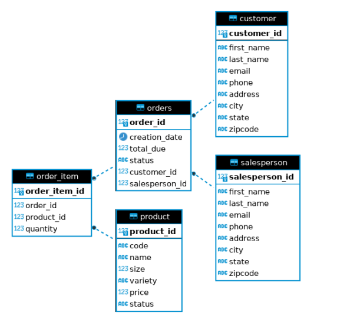

# Introduction

This app connects to an RDBMS using JDBC and PostgreSQL. Through this app you can create, update, and delete a customer in the database, as well as find and sort a list of customers. It also allows you to find an order by ID and, using a stored procedure, get orders by customer ID. Maven was used to manage this project

# Implementaiton
## ER Diagram

## Design Patterns

As this app isolates the application layer from the database (persistance layer), it uses the Data Access Object (DAO) pattern. It does this by having a DataAccessObject class and DataTransferObject interface that define an abstract API that performs CRUD operations on objects of type T. As a result, a well-defined and detailed implementation that works with Customer and Order objects is provided, while the CustomerDAO and OrderDAO classes provide all the necessary functionality for the those objects. The DAO classes hide all the low-level details on how the objects are manipulated. Because this app uses the DAO pattern, it allows the data access mechanisms to change independently of the code that uses that data, effectively separating a data resource's client interface from its data access mechanisms.

# Test

The app was tested by writing queries for each method and comparing their output to the database using the JDBCExecutor and printing to the console.