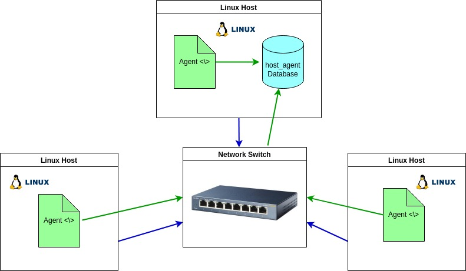

# Introduction
Linux_SQL is a project that produces an MVP. It uses a bash script (docker.sh) to create a docker image in order to set up a postgres psql instance that persists the data between nodes. In order for the Linux Cluster Administration (LCA) to gather and monitor hardware specification and usage data, this project includes 2 bash scripts. The host_info.sh script gathers the host's hardware info once, while the host_usage.sh script monitors resource usage every minute using crontab. Both of these scripts automatically insert the data into a RDBSM database (host_agent). The database is created via ddl.sql, which uses a Data Definition Language. This project also includes some sql scripts that allow the LCA to make some business queries to better monitor cluster usage. These queries allow the user to group hosts by hardware info, display average memory used in percentage over 5 mins interval for each host, and detect any host failures through the crontab process. 

# Quick Start
- Start a psql instance using psql_docker.sh
```bash
./scripts/psql_docker.sh start|stop|create [db_username][db_password]
```
- Create tables using ddl.sql
```bash
psql -h localhost -U postgres -d host_agent -f sql/ddl.sql
```
- Insert hardware specs data into the DB using host_info.sh
```bash
./scripts/host_info.sh psql_host psql_port db_name psql_user psql_password
```
- Insert hardware usage data into the DB using host_usage.sh
```bash
bash scripts/host_usage.sh psql_host psql_port db_name psql_user psql_password
```
- Crontab setup
```bash
* * * * * bash /absolute_path_of_script/host_usage.sh localhost 5432 host_agent postgres password > /tmp/host_usage.log
```

# Implemenation
The project was implemented using Linux command lines, Bash scripts, PostgreSQL, docker, IDE, crontab, RDBSM database, ddl, and SQL queries

## Architecture


## Scripts
For usage please see Quick Start
- psql_docker.sh - sets up a psql instance using docker
- host_info.sh - collects hardware specification data then inserts that data into the psql database (host_agent)
- host_usage.sh - collects server usage data then inserts that data into the psql database (host_agent)
- crontab - executes host_usage.sh every minute
- queries.sql 
  1. Group hosts by CPU number and sort by memory size in descending order
  2. Average used memory over 5 minute intervals displayed as a percentage for each host
  3. Detect host failure, considers a server as failed when it inserts less than 3 data points within a 5-minute interval


## Database Modeling
- `host_info`

| id | hostname | cpu_number | cpu_architecture | cpu_model | cpu_mhz | l2_cache | total_mem | timestamp |
|----|----------|------------|------------------|-----------|---------|----------|-----------|-----------|
|  auto increment, primary key  |   fully qualified hostname       |   INT         |      VARCHAR(100)            |     VARCHAR(100)      |    NUMERIC     |     in kB     |         in kB  |      current time in UTC     |

- `host_usage`

| timestamp | host_id | memory_free | cpu_idle | cpu_kernel | disk_io | disk_available |
|-----------|---------|-------------|----------|------------|---------|----------------|
| UTC timezone | id from host_info table | in MB | in % | in % | number of disk I/O | in MB |

# Test
Because of limitations the program was tested on a single machine, as opposed to a Linux cluster. Bash scripts were tested manually by executing with correct, incorrect, and insufficient CLI arguments. In all cases, the bash scripts functioned as expected. SQL queries were tested against data manually inserted into the tables (due to only having a single machine). 

# Deployment
The source code was managed via GitHub. Bash scripts are executed using the command line, and the host_usage.sh was scheduled with crontab. Docker is used to provision the database, and sql queries are executed through postgres.

# Improvements
Write at least three things you want to improve
- handle hardware updates - host info is only run once
- add more sql queries 
- more robust testing - test with Linux cluster, and with gathered host data
